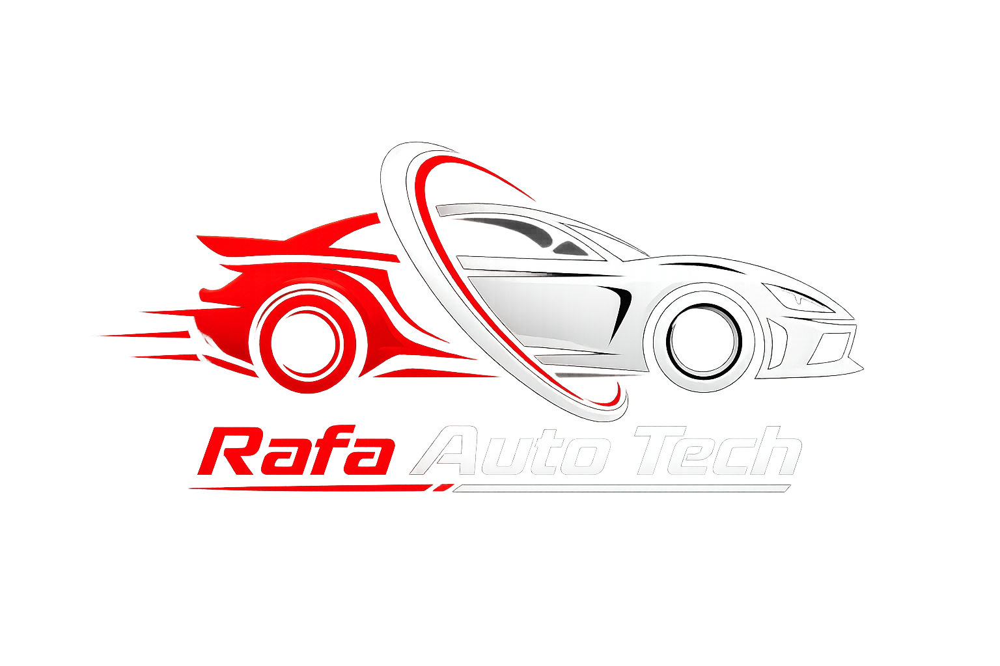
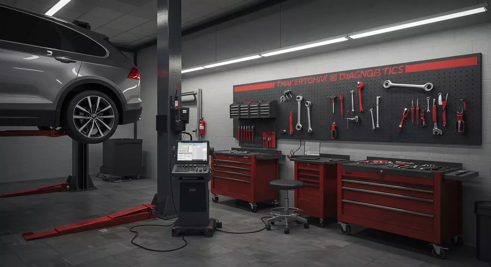

[Uploading Moreiramotors.css…]()
*{
    margin: 0;
    padding: 0;
    box-sizing: border-box;
}

html{
    scroll-behavior: smooth;
}

body{
    background-color: rgb(245, 238, 238);
    color: black;
    font-family: Arial, Helvetica, sans-serif;
}

/* HEADER */

header{
    background-color: rgb(15, 9, 9);
    height: 95px;

    display: flex;
    align-items: center;
    justify-content: center;

    position: relative;
    padding: 10px 30px;
}

header img{
    width: 220px;
    height: auto;

    position: absolute;
    left: 30px;

    filter: drop-shadow(0px 0px 8px rgba(207, 13, 13, 0.35));

    transition: 0.3s;
}

header img:hover{
    transform: scale(1.04);
}

/* NAV */

nav{
    display: flex;
    align-items: center;
    justify-content: center;

    gap: 45px;
}

nav a{
    position: relative;

    font-size: 17px;
    font-weight: bold;

    text-decoration: none;
    color: white;

    padding: 8px 3px;

    transition: 0.3s;
}

nav a::after{
    content: "";

    position: absolute;

    width: 0;
    height: 2px;

    left: 50%;
    bottom: 0;

    background-color: rgb(207, 13, 13);

    transform: translateX(-50%);

    transition: 0.3s;
}

nav a:hover{
    color: rgb(207, 13, 13);
}

nav a:hover::after{
    width: 100%;
}

/* INÍCIO */

.inicio{
    min-height: 300px;

    display: flex;
    align-items: center;
    justify-content: center;

    text-align: center;

    padding: 40px 20px;

    background:
        linear-gradient(
            rgba(0,0,0,0.65),
            rgba(0,0,0,0.65)
        ),
        url("oficina-fundo.jpg");

    background-size: cover;
    background-position: center;

    color: white;
}

.inicio-texto{
    max-width: 700px;
}

.inicio h1{
    font-size: 39px;
    margin-bottom: 35px;
}

.inicio p{
    font-size: 17px;
    margin-bottom: 10px;
}

/* BOTÕES */

button{
    margin-top: 20px;

    background-color: rgb(207, 13, 13);
    color: white;

    border-radius: 20px;

    height: 45px;
    width: 180px;

    border: none;

    cursor: pointer;

    font-weight: bold;
    font-size: 15px;

    transition: 0.2s;
}

button:hover{
    transform: scale(1.05);

    box-shadow:
        0px 0px 12px
        rgba(207, 13, 13, 0.6);
}

/* BOTÃO WHATSAPP */

.whatsapp{
    background-color: rgb(33, 155, 8);
    color: white;

    box-shadow:
        0px 0px 12px
        rgba(136, 224, 136, 0.7);
}

.whatsapp:hover{
    background-color: rgb(136, 224, 136);
}

/* SERVIÇOS */

.servicos{
    padding: 70px 20px;

    text-align: center;
}

.servicos h2,
.galeria h2,
.sobre h2,
.contato h2{
    font-size: 32px;
    margin-bottom: 15px;
}

.subtitulo{
    margin-bottom: 40px;
}

/* CARDS */

.servicos-container{
    max-width: 1000px;

    margin: auto;

    display: grid;

    grid-template-columns: repeat(3, 1fr);

    gap: 25px;
}

.servico{
    background-color: white;

    padding: 30px 20px;

    border-radius: 12px;

    box-shadow:
        0px 3px 10px
        rgba(0,0,0,0.12);

    transition: 0.2s;

    cursor: pointer;
}

.servico:hover{
    transform: translateY(-5px);
}

.servico h3{
    margin-bottom: 15px;

    color: rgb(180, 10, 10);
}

.servico p{
    line-height: 1.5;
}

/* GALERIA */

.galeria{
    padding: 70px 20px;

    background-color: rgb(25, 20, 20);

    color: white;

    text-align: center;
}

.fotos{
    max-width: 1100px;

    margin: 40px auto 0;

    display: grid;

    grid-template-columns: repeat(3, 1fr);

    gap: 20px;
}

.fotos img{
    width: 100%;
    height: 250px;

    object-fit: cover;

    border-radius: 10px;

    transition: 0.3s;

    cursor: pointer;
}

.fotos img:hover{
    transform: scale(1.03);
}

/* SOBRE */

.sobre{
    padding: 70px 20px;

    text-align: center;
}

.sobre div{
    max-width: 700px;

    margin: auto;
}

.sobre p{
    line-height: 1.6;

    margin-top: 15px;
}

/* CONTATO */

.contato{
    padding: 70px 20px;

    background-color: rgb(87, 79, 79);

    color: white;

    text-align: center;
}

.contato button{
    background-color: rgb(33, 155, 8);
}

/* FOOTER */

footer{
    background-color: rgb(15, 9, 9);

    color: white;

    text-align: center;

    padding: 25px;
}

/* RESPONSIVIDADE */

@media (max-width: 700px){

    header{
        height: auto;
        min-height: 130px;

        flex-direction: column;

        gap: 15px;

        padding: 15px;
    }

    header img{
        position: static;

        width: 150px;
    }

    nav{
        gap: 18px;
[Rafaautotech.js](https://github.com/user-attachments/files/31442753/Rafaautotech.js)
    }

    nav a{
        font-size: 14px;
    }

    .inicio{
        min-height: 450px;
    }

    .inicio h1{
        font-size: 34px;
    }

    .inicio p{
        font-size: 17px;
    }

    .servicos-container{
        grid-template-columns: 1fr;
    }

    .fotos{
        grid-template-columns: 1fr;
    }

    .fotos img{
        height: 220px;
    }

}

[Moreiramotors.html](https://github.com/user-attachments/files/31442750/Moreiramotors.html)

<!DOCTYPE html>
<html lang="pt-br">
<head>
    <meta charset="UTF-8">
    <meta name="viewport" content="width=device-width, initial-scale=1.0">
    <title>Rafa Auto Tech</title>
    
    <link rel="stylesheet" href="Moreiramotors.css">
</head>

<body>

    <header>
        

        <nav>
            <a href="#inicio">Início</a>
            <a href="#servicos">Serviços</a>
            <a href="#sobre">Sobre Nós</a>
            <a href="#contato">Contato</a>
        </nav>

    </header>

<main>
 <!--Inicio-->

    <section class="inicio" id="inicio">

    

    <h1>Oficina Automotiva Rafa Tech Auto</h1>

    

        Cuidando do seu carro com qualidade, segurança e confiança.
    

        <button onclick="agendarServico()">
            Agendar serviço
        </button>
        
    

    </section>

<!--Serviços-->

<section class="servicos" id="servicos">

    <h2>Nossos Serviços</h2>

    

        Manutenção completa para manter seu veículo sempre em perfeito estado.
    

    

          <h3>🔧 Manutenção Preventiva</h3>
            

                Revisões e manutenção preventiva para
                evitar problemas futuros no seu veículo.
            

    

    

                    <h3>🛑 Freios</h3>
                    

                        Troca de pastilhas, discos, lonas e
                        revisão completa do sistema de freios.
                    

                

      

                    <h3>🛢️ Troca de Óleo</h3>
                    

                        Troca de óleo e filtros para garantir
                        o bom funcionamento e a durabilidade do motor.
                    

                

                

                    <h3>⚙️ Motor</h3>
                    

                        Diagnóstico e manutenção para problemas
                        relacionados ao motor do veículo.
                    

                

                

                    <h3>💻 Diagnóstico</h3>
                    

                        Diagnóstico eletrônico para identificar
                        falhas e problemas no veículo.
                    

                
 
                
                

                    <h3>🔋 Bateria</h3>
                    

                      Teste, diagnóstico e substituição da bateria
                    do veículo.
                    

</section>

<!--fotos-->

<section class="galeria">

    <h2>Nosso trabalho</h2>

    

        

        

        

    

</section>

<!--Sobre-->
<section class="sobre" id="sobre">

                <h2>Sobre a Rafa tech Auto</h2>

                

                    Na Rafa Tech Auto, trabalhamos para oferecer
                    serviços automotivos com qualidade, segurança
                    e transparência.
                

                

                    Nosso objetivo é cuidar do seu veículo para que
                    você possa dirigir com tranquilidade e confiança.
                

</section>

<!--contato-->

<section class="contato" id="contato">

    <h2>Precisa de Manutenção?</h2>

    

        Entre em contato conosco e agende seu serviço.
    

    <button class="whatsapp" onclick="agendarServico()">
       💬 Falar pelo WhatsApp
    </button>

</section>

</main>

<footer>
    
© 2026 Rafa Auto Tech

</footer>

</body>

</html>

[Uploading Rafaautotech.js…]()
 function agendarServico() {

    const telefone = "5511964715306";
    const mensagem = "Olá! Gostaria de agendar um serviço para o meu veículo na Rafa Auto Tech.";

    const app = `whatsapp://send?phone=${telefone}&text=${encodeURIComponent(mensagem)}`;
    const web = `https://web.whatsapp.com/send?phone=${telefone}&text=${encodeURIComponent(mensagem)}`;

    // Tenta abrir o aplicativo
    window.location.href = app;

    // Se o aplicativo não abrir, vai para o navegador
    setTimeout(function() {
        window.location.href = app;
    }, 5000);
}
